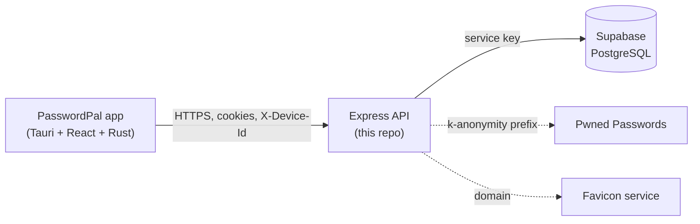
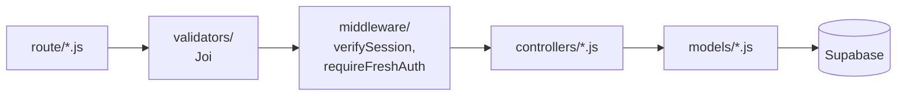
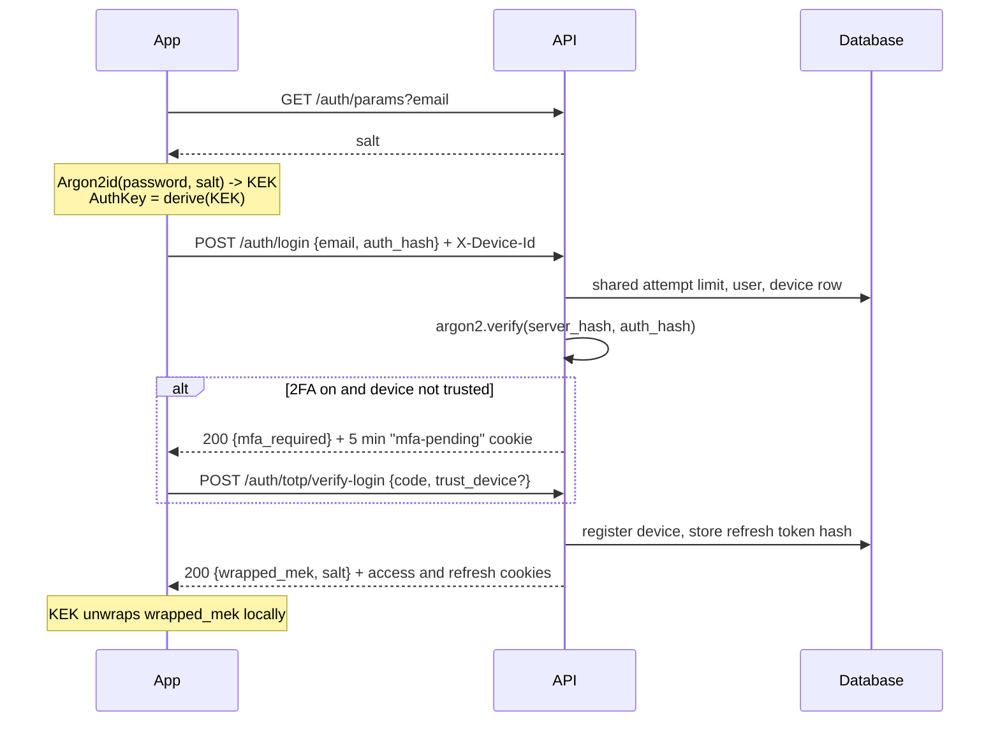
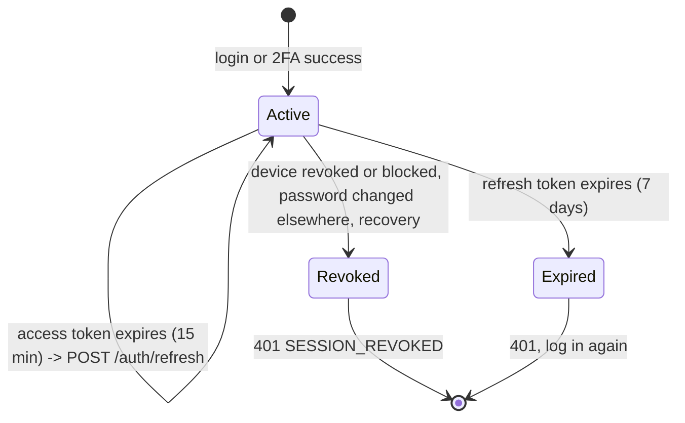

# Architecture

This document explains how the backend is organised and how a request, a login and a session move through it. For what the server can and cannot see, read [SECURITY_MODEL.md](SECURITY_MODEL.md). For endpoints, see [API.md](API.md).

## Overview

The app does all cryptography. It derives keys from the master password, encrypts the vault, and sends the API only ciphertext and a derived authentication value. The API authenticates users, stores and syncs ciphertext, and keeps account metadata. The database is reachable only from the API.

## Layers

Every request moves through the same layers:

| Layer | Folder | Responsibility |
| :--- | :--- | :--- |
| App | `app.js`, `server.js` | JSON and cookie parsing, CORS, trust-proxy setup, the database gatekeeper, health check |
| Routes | `route/` | Map a URL and method to validators, middleware and a controller |
| Validation | `validators/` | Joi schemas and the `validateRequest` middleware. Malformed input stops here with a 400 |
| Middleware | `middleware/` | `verifySession` (who and which device) and `requireFreshAuth` (recent password check) |
| Controllers | `controllers/` | Business rules and the HTTP response |
| Models | `models/` | All database access, one file per table or concern |
| Utilities | `utils/` | Session cookies, shared rate limiter, TOTP, recovery signature check, encryption of TOTP secrets, client IP, dev-only static files |

### Cross-cutting pieces

- **Database gatekeeper** (`app.js`). While `config/db.js` reports that Supabase is unreachable, every `/api` and `/auth` route (except `/auth/logout`) answers `503`. The app uses this to switch to offline mode quickly instead of waiting for 500s. `GET /health` is `204` when the database is reachable and `503` otherwise.
- **Client IP** (`utils/clientIp.js`). `TRUST_PROXY_HOPS` sets how many proxies Express trusts when reading `X-Forwarded-For`. Rate limiting and the audit log use `req.ip`, so this must match the deployment.
- **CORS** allows `FRONTEND_URL` (default `http://localhost:5173`), `http://tauri.localhost` and `tauri://localhost`, with credentials.
- **Dev-only routes** (`/scripts` static files and `/auth/totp/dev/backup-codes/generate`) are not mounted when `NODE_ENV=production`.

## Authentication flow

Login is two requests, because the app needs the account salt before it can derive the authentication value.

The `mfa-pending` token is not a session. `verifySession` rejects it because it has no device (`did`) claim, and it can only be used on the TOTP verification endpoints.

## Session lifecycle

- **Tokens.** `setSessionCookies` (`utils/session.js`) signs an access token (15 min) and a refresh token (7 days) with the claims `id`, `email`, `did` (device row id) and `auth_time` (when the password was last proven). Both are `HttpOnly` cookies: `SameSite=Strict` in development, `Secure` + `SameSite=None` in production.
- **Per-request device check.** `verifySession` verifies the JWT and then reads the device row. If the device is missing, revoked or blocked, the request fails with `401 SESSION_REVOKED`. The database is the source of truth on every request, not the token lifetime. If the lookup itself fails, the request fails with `503` rather than letting the session through.
- **Refresh.** `POST /auth/refresh` repeats the device check, issues new cookies and keeps the original `auth_time`, so a silent refresh never looks like a fresh password entry. The refresh token is stored as a SHA-256 hash.
- **Fresh authentication.** `requireFreshAuth` allows an action only if `auth_time` is within 5 minutes. A user gets a fresh `auth_time` by logging in or calling `POST /auth/verify-password`. It answers `403 REAUTH_REQUIRED` (not 401) so the client asks for the password instead of trying to refresh.
- **Ending sessions.** Logout, device revoke/block, password change (all other devices), and recovery (all devices) end sessions. See [SECURITY_MODEL.md](SECURITY_MODEL.md).

## Vault storage and sync

Vault entries are opaque to the server: `encrypted_data` and a `nonce`, plus `version`, `is_deleted` and `record_type` (`credential`, `folder`, `tag`).

- **Optimistic locking.** Each record has a `version`. A write only succeeds if the client sends the version it last saw; otherwise the server answers `409` with `server_version` (CRUD) or reports a conflict for that record (sync) and the client resolves it.
- **Soft deletes.** Deleting sets `is_deleted` so other devices learn about it on their next sync.
- **Delta sync.** `GET /api/vault/sync?since=` returns records changed after a timestamp, paged by `limit` (max 500) and `offset`. `POST /api/vault/sync` pushes a batch; each record gets its own result, so one failure does not abort the rest.

## Where to look when you change something

| If you change... | Start in | Also check |
| :--- | :--- | :--- |
| Login, register, recovery, password change | `controllers/authController.js` | `utils/session.js`, `utils/attemptLimit.js`, `tests/recovery.test.js` |
| 2FA | `controllers/totpController.js`, `utils/totp.js` | `models/mfaSettingsModel.js`, `tests/totp*.test.js` |
| Sessions and devices | `middleware/verifySession.js`, `models/deviceModel.js` | `controllers/deviceController.js` |
| Vault and sync | `controllers/vault*.js`, `models/vaultModel.js` | `validators/schemas.js` |
| Schema | `scripts/migrations/`, `scripts/init_db.sql` | `validators/schemas.js`, `tests/dbAccess.test.js` |
