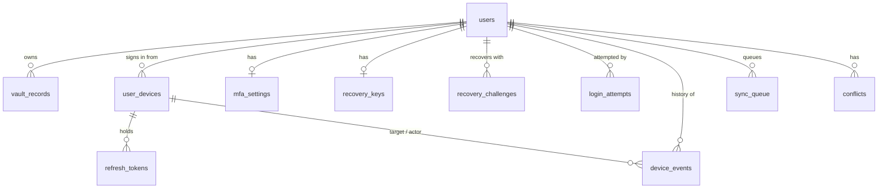

# Database

PostgreSQL on Supabase. `scripts/init_db.sql` creates the complete, current schema for a new project. `scripts/migrations/` holds the incremental changes for projects created earlier. Only the backend reads or writes these tables, using the secret (service role) key.

## Entity relationships

## Tables

| Table | Purpose | Key columns |
| :--- | :--- | :--- |
| `users` | One row per account | `email` (unique), `salt`, `server_hash` (Argon2id of the client `auth_hash`), `wrapped_mek`, `kdf_params` |
| `vault_records` | Encrypted vault entries | `encrypted_data`, `nonce`, `version` (optimistic lock), `is_deleted` (tombstone), `record_type` (`credential`/`folder`/`tag`) |
| `user_devices` | One row per device that signed in | `device_fingerprint` (client UUID, unique per user), `is_revoked`, `is_blocked`, `trusted_until` (2FA skip window), `refresh_token` (hash) |
| `refresh_tokens` | Refresh tokens by device | `token_hash` (SHA-256), `expires_at`, `is_revoked`, `replaced_by_token_id` |
| `mfa_settings` | TOTP state per user | `totp_secret_enc` (encrypted), `is_totp_enabled`, `backup_codes_enc` (hashed), `last_used_step` (replay protection) |
| `login_attempts` | Login and secret-check history, also the rate-limit counter | `ip_address`, `was_successful`, `failure_reason`, `device_id`, `attempt_time` |
| `recovery_keys` | Recovery verification key | `public_key` (Ed25519, 64 hex) |
| `recovery_challenges` | One-time recovery challenges | `challenge_hash` (SHA-256), `user_id`, `expires_at` (5 minutes) |
| `device_events` | Revoke, block and unblock history | `action`, target and actor device ids plus name snapshots |
| `sync_queue`, `conflicts` | Reserved for server-side sync bookkeeping | Not used by the current controllers |

Notes:

- `login_attempts.failure_reason` has a CHECK constraint. Adding a new reason in code requires a migration that extends it (see migrations `2026-10-05`, `2026-10-08`).
- `vault_records` writes go through the SQL functions `atomic_upsert_vault_record` and `update_vault_record`, which enforce the version check atomically.
- `login_attempts.user_id` is `ON DELETE SET NULL` at the database level, while most other tables cascade. (`DELETE /api/delete-account` also removes the user's login attempts explicitly.)

## Access control

- Row Level Security is enabled on every table.
- `anon` and `authenticated` have no table privileges and no execute rights on the SQL functions; default privileges are revoked for future objects too. Only `service_role` has access.
- The policies in `init_db.sql` that mention `auth.uid()` are inert because those roles have no grants. They are kept so the intent is visible if direct client access is ever introduced.

If you add a table, enable RLS, grant it to `service_role` only, and extend `tests/dbAccess.test.js` if needed.

## Migrations

Run in filename order. Each file is safe to run twice. When a migration says "BEFORE deploying", run it first, because the new code relies on it.

| File | Change |
| :--- | :--- |
| `2026-09-28_device_blocking.sql` | Per-device sessions, `is_blocked`, device id on login attempts |
| `2026-10-04_device_events.sql` | `device_events` table |
| `2026-10-04_login_attempt_failure_reason.sql` | `failure_reason` on `login_attempts` |
| `2026-10-05_login_attempt_failure_reasons.sql` | More failure reasons (recover, verify-password, change-password) |
| `2026-10-06_recovery_signature.sql` | `recovery_keys.public_key`, `recovery_challenges` |
| `2026-10-07_lock_down_database_access.sql` | RLS and grants: backend-only access |
| `2026-10-08_login_attempt_totp_reasons.sql` | Failure reasons for 2FA code and backup-code checks |
| `2026-10-09_totp_replay_protection.sql` | `mfa_settings.last_used_step` |
| `2026-10-10_drop_legacy_recovery_columns.sql` | Remove `recovery_keys.key_hash` and `expires_at` |

### Adding a migration

1. Create `scripts/migrations/YYYY-MM-DD_description.sql`, written to be re-runnable.
2. Apply the same change to `scripts/init_db.sql`.
3. Update `validators/schemas.js` and any model code.
4. Mention in the pull request when it has to be run relative to the deploy.
