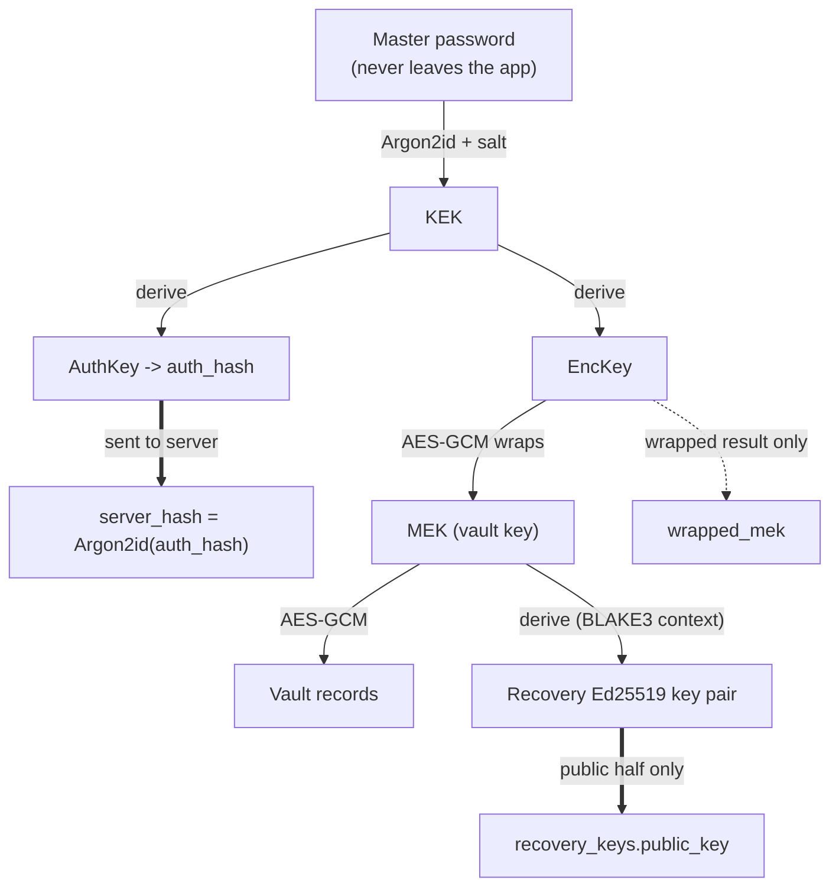

# Security model

This describes what the backend protects, how, and where the limits are. The client side of the same design is described in the frontend repository's `docs/CRYPTO.md`.

## What the server knows

| The server stores | The server never receives |
| :--- | :--- |
| `salt` (per-user, for the key derivation) | The master password |
| `server_hash`: Argon2id hash of the client's `auth_hash` | The key-encryption key (KEK) and the encryption key |
| `wrapped_mek`: the vault key encrypted with the KEK | The unwrapped master encryption key (MEK) |
| `encrypted_data` + `nonce` per vault record | Any plaintext vault content |
| `recovery_keys.public_key` (Ed25519, 64 hex) | The recovery key or its private key |
| Account email, device rows, login history | |

A database leak therefore exposes ciphertext, salts and password-hash-of-a-derived-value, not passwords or vault contents. Cracking `server_hash` needs a guess of a value that is itself the output of a slow client-side KDF (Argon2id, 64 MiB, 3 passes) and is then hashed again with Argon2id on the server.

## Key hierarchy (server's view)

Bold arrows leave the device. Everything else stays in the app.

## Authentication and sessions

- **Passwords.** Login compares `auth_hash` to `server_hash` with Argon2id (`m=65536`, `t=3`, `p=4`). Unknown email and wrong password produce the same `401 Invalid credentials`.
- **Cookies.** Access (15 min) and refresh (7 days) tokens are `HttpOnly`. In production they are `Secure` and `SameSite=None` (the Tauri app is cross-origin); in development `SameSite=Strict`.
- **Device binding.** Each session carries a device id (`did`) and each request is checked against the device row. A revoked or blocked device gets `401 SESSION_REVOKED` on its next request. Blocked devices are also refused at login before the password is checked.
- **Refresh tokens.** Stored only as SHA-256 hashes. A refresh checks the device row again and keeps the original `auth_time`.
- **Fresh authentication.** Export and account deletion need a password check within the last 5 minutes (`requireFreshAuth`, `403 REAUTH_REQUIRED`).
- **Password change.** Requires the current password, replaces `salt`, `wrapped_mek` and `server_hash` with the values the app sends (the app re-wraps the same vault key, so vault data is not re-encrypted), signs out all other devices and clears every trusted device.

## Brute-force protection

`utils/attemptLimit.js` implements one shared budget: **5 failed attempts per IP per 15 minutes**, counted in `login_attempts`. It covers login, recovery, `verify-password`, `change-password`, 2FA login verification, backup-code redemption and 2FA disable. Because the budget is shared, switching endpoint does not reset it. Attempts that fail only because the device is blocked are not counted. Over the limit the API answers `429`. Client IPs come from `req.ip`, which depends on `TRUST_PROXY_HOPS`.

## Two-factor authentication

- **TOTP** (30 s step) is verified with a window of one step either side (`utils/totp.js`, `TOTP_WINDOW = 1`).
- **Replay protection.** After a successful check the matched step is stored in `mfa_settings.last_used_step` with a conditional update (`consumeTotpStep`). A code from the same or an earlier step is refused with `401 TOTP_CODE_REUSED`, even under concurrent requests.
- **Secrets at rest.** TOTP secrets are encrypted with `ENCRYPTION_KEY` (`utils/encryption.js`). The server will not start in production without that key. Backup codes are stored hashed and each works once.
- **Pending step.** After the password check, a 5-minute `mfa-pending` token is issued. It is not a session; an expired one returns `401 MFA_SESSION_EXPIRED`.
- **Trusted devices.** On request (`trust_device`) after a valid TOTP code, `user_devices.trusted_until` is set 30 days ahead and that device skips the 2FA step. Trust is stored server-side per device, not in a cookie. Password change and account recovery clear it.
- **Disabling 2FA** requires a valid authenticator code (single-use) or an unused backup code.

## Account recovery

Details are in [RECOVERY_SIGNATURE_DESIGN.md](RECOVERY_SIGNATURE_DESIGN.md). In short:

1. At registration the app derives an Ed25519 key pair from the vault key and sends only the public key.
2. To recover, the app requests a one-time challenge (32 random bytes, 5 minutes). The server stores only its SHA-256.
3. The app signs the challenge together with the new salt, wrapped key and auth hash, using length-prefixed fields so fields cannot be shifted between each other.
4. The server verifies the signature against the stored public key, then consumes the challenge with an atomic delete (so it works once), updates the credentials and revokes all devices.

Nothing sent during recovery can be replayed: the challenge is single-use and the signature covers the new credentials.

## Database access

Row Level Security is enabled on every table, and the `anon` and `authenticated` roles have their privileges revoked (including on `SECURITY DEFINER` functions). The API connects with the secret (service role) key, which bypasses RLS, so **the API is the only access path**. `SUPABASE_SECRET_KEY` must never be exposed to a client. `tests/dbAccess.test.js` guards these grants.

## Privacy proxies

`/api/breach/:prefix` forwards only the first five hex characters of a SHA-1 (k-anonymity) to Pwned Passwords. `/api/favicon` fetches icons from a favicon service so the user's IP is not sent to it; that service does learn the domain.

## Threat model

| Threat | Mitigation | Residual risk |
| :--- | :--- | :--- |
| Database or backup leak | Ciphertext only; double-hashed auth value; TOTP secrets encrypted; refresh tokens hashed | Weak master passwords remain guessable offline against `wrapped_mek` |
| Online password guessing | Shared per-IP limit, Argon2id cost | Attacker with many IPs; users behind one IP share a budget |
| Stolen session cookie | `HttpOnly`, short access token, per-request device check, revoke/block | Valid until the user revokes the device or the refresh token expires |
| Captured recovery request | One-time signed challenge | None for replay; the recovery key itself must stay secret |
| Captured 2FA code | Single-use steps, narrow window | A code can still be used once if the attacker is faster than the user |
| Compromised server secrets | None for vault contents (server cannot decrypt) | `JWT_SECRET` leak allows forging sessions; rotate it |
| Malicious or buggy client | Server-side validation, optimistic locking | The server cannot verify that ciphertext is well formed |

## Known limitations

These are open for contributors:

- Refresh-token rotation does not detect reuse of an old token.
- Disabling and re-enabling 2FA does not clear trusted devices.
- `POST /auth/totp/verify-setup` is not covered by the shared limiter.
- `GET /auth/params` and `POST /auth/recover` answer `404` for unknown accounts, which lets a caller check whether an email is registered (`/auth/recover/challenge` is uniform).
- The limiter is per IP only; there is no per-account lockout.
- `/api/favicon` is unauthenticated and not rate limited.
- A revoked device that is offline keeps whatever vault it already holds until it next talks to the server. The client should add a periodic authenticated check and an offline time limit.
